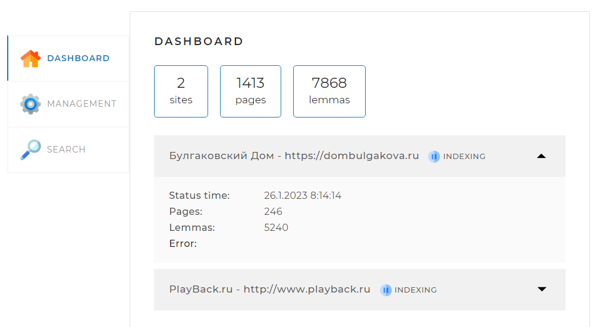

# Поисковый движок


## Описание

Поисковый движок представляет из себя Spring-приложение (JAR-файл, запускаемый на любом сервере или компьютере), работающее с локально установленной базой данных MySQL.
Для разработки использовался JDK 17-й версии.


## Принципы работы поискового движка

- В конфигурационном файле **SearchEngine.yaml** перед запуском приложения задаются адреса сайтов, по которым движок должен осуществлять поиск.
```
indexing-settings:
  sites:
    - url: https://dombulgakova.ru
      name: Булгаковский Дом
    - url: http://www.playback.ru
      name: PlayBack.ru
```

Также нужно создать базу данных и прописать настройки подключения.
```
spring:
  datasource:
    url: jdbc:mysql://localhost:3307/searchengine?useSSL=false&serverTimezone=UTC&useUnicode=true&characterEncoding=utf8&allowPublicKeyRetrieval=true
    username: root
    password: usbw
```

- Поисковый движок самостоятельно обходит все страницы заданных сайтов и индексирует их (создаёт так называемый индекс) так, чтобы потом находить наиболее релевантные страницы по любому поисковому запросу.
- Пользователь присылает запрос через API движка. Запрос - это набор слов, по которым нужно найти страницы сайта.
- Запрос определённым образом трансформируется в список слов, переведённых в базовую форму. Например, для существительных - именительный падеж, единственное число. Поиск осуществляется только на русском языке.
- В индексе ищутся страницы, на которых встречаются все эти слова.
- Результаты поиска ранжируются, сортируются и отдаются пользователю.


## Скриншоты




## Запуск
> java -jar SearchEngine.jar

После запуска сайт будет доступен по адресу [http://localhost:8081/](http://localhost:8081/)
